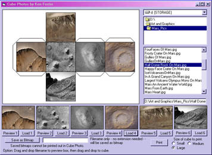



## Cube Photos\(update added aspect ratio\)

### Description

Load your pictures and print bitmap out. Cut,fold, and paste into a photocube.Added Print, drag&drop and aspect ratio of image to program.Hopefully this is the last update needed.
 
### More Info
 

             |
---                |---
**Submitted On**   |2004-06-25 17:12:34
**By**             |[Kenneth Foster](https://github.com/Planet-Source-Code/PSCIndex/blob/master/ByAuthor/kenneth-foster.md)
**Level**          |Intermediate
**User Rating**    |5.0 (50 globes from 10 users)
**Compatibility**  |VB 6\.0
**Category**       |[Complete Applications](https://github.com/Planet-Source-Code/PSCIndex/blob/master/ByCategory/complete-applications__1-27.md)
**World**          |[Visual Basic](https://github.com/Planet-Source-Code/PSCIndex/blob/master/ByWorld/visual-basic.md)
**Archive File**   |[Cube\_Photo1762026252004\.zip](https://github.com/Planet-Source-Code/kenneth-foster-cube-photos-update-added-aspect-ratio__1-54544/archive/master.zip)

